## A walkthrough of the [Funbox Scriptkiddie](https://www.vulnhub.com/entry/funbox-scriptkiddie,725/) ScriptKiddie VM from Vulnhub

This is labelled as a very easy box on vulnhub so thought it would be a good one for my first walkthrough on this blog. 

So I booted up the Funbox Scriptkiddie VM and my Kali linux VM and ran a nmap scan to determine what ports were open. 

[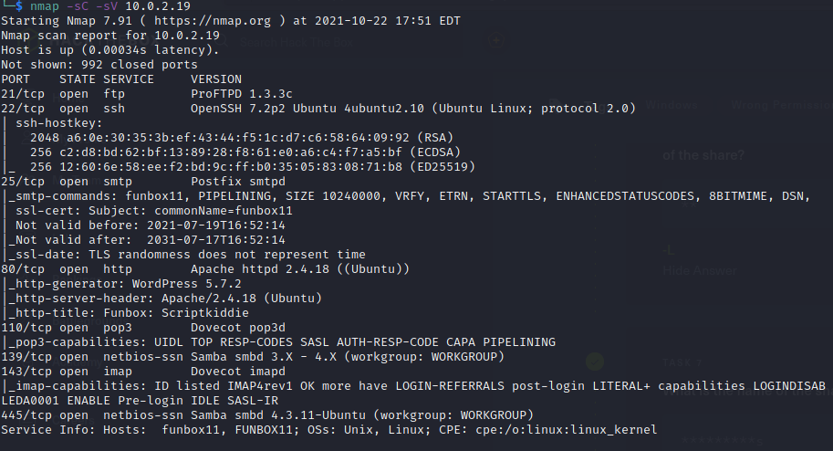](../images/scriptkiddie/nmap.png)

As you can see there are a lot of ports open. The first port I wanted to check out was port 80 http running apache.  I fired up firefox to take a look at the website.

After trying to read the one and only blog post on the site I noticed it directed me to the domain **funbox11**.  So I updated my /etc/hosts file with the newly discovered domain. 

After poking around on the website for a few minutes I couldn't find anything of interest.  

[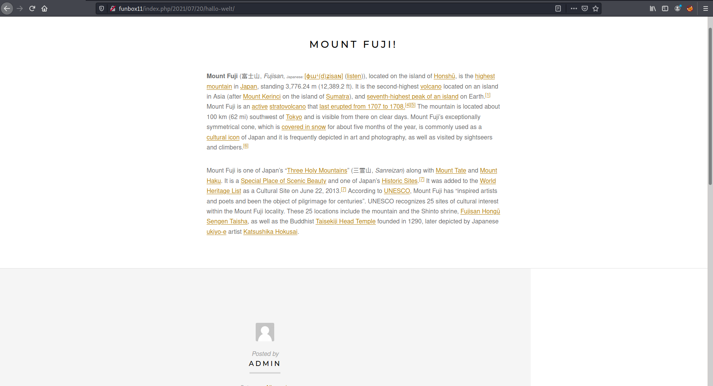](../images/scriptkiddie/funbox2.png)

So I ran a gobuster scan to enumerate further.  From the results I could see this was a wordpress blog. 

[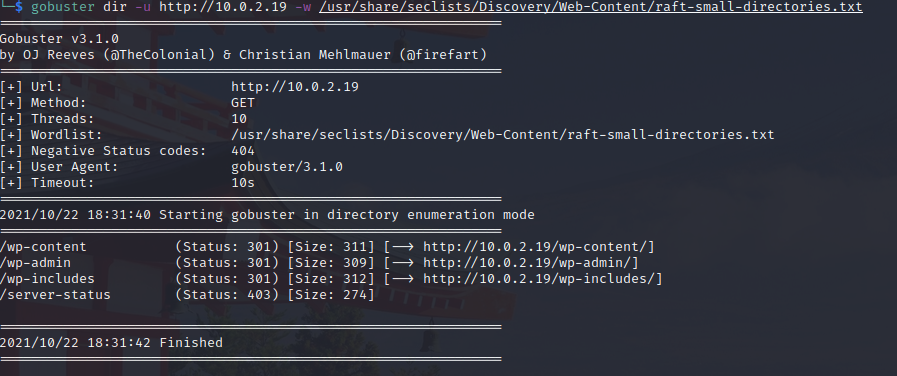](../images/scriptkiddie/gobuster.png)

So I went to the /wp-admin page to try the wordpress default credentials admin:password but did not have any luck.  

[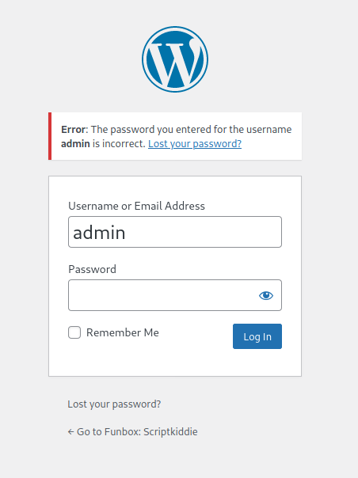](../images/scriptkiddie/wpadmin.png)

My next thought was to try and bruteforce the password for the admin user (as I could see the user was valid from the login error message).  I used the tool wpscan and ran the bruteforce attempt with the wordlist /usr/share/wordlists/rockyou.txt. 

[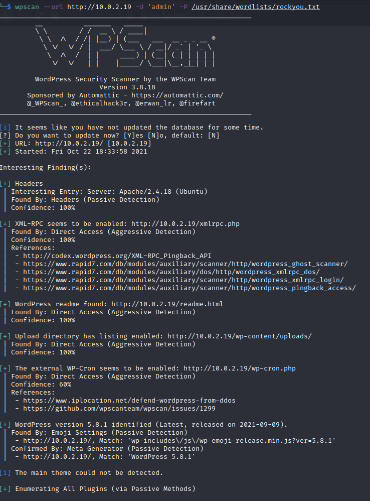](../images/scriptkiddie/wpscan1.png)
  
While that was running I thought I would take a look at the other open ports, as it always good to have some kind of enumeration running in the background while doing something else actively.  My next stop was port 21 FTP.  After trying to login with the anonymous user with no success I checked back on my wpscan bruteforce attempt which had not yet found the password. 

[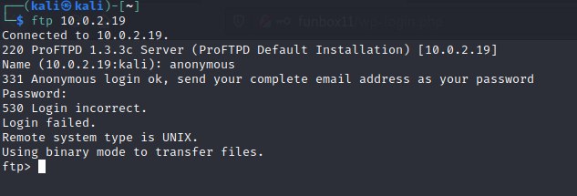](../images/scriptkiddie/ftp.png)
  
[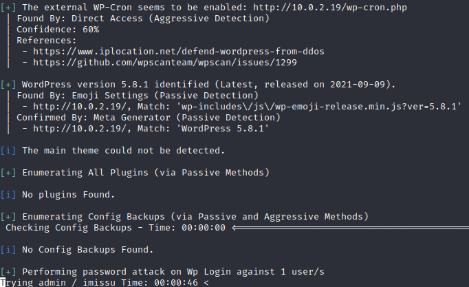](../images/scriptkiddie/wpscan2.png)

It was at this point I stopped and thought for a few moments.  From my nmap scan I had discovered the version of the ftp service on port 21, ProFTPD 1.3.3c.  With this information I decided to take a look at searchsploit to see if there are any known exploits for this version.  Bingo!

[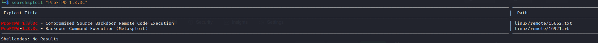](../images/scriptkiddie/searchsploit.png)

I fired up metasploit and configured the known exploit with the required target IP and the payload type. 

[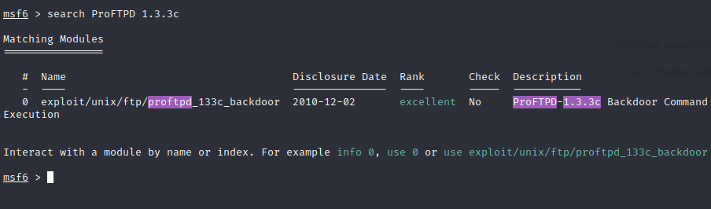](../images/scriptkiddie/msfconsole1.png)
  
[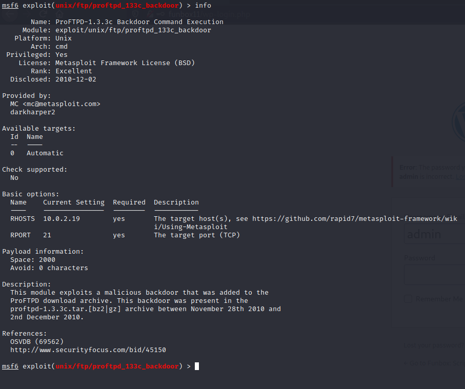](../images/scriptkiddie/msfconsole2.png)

[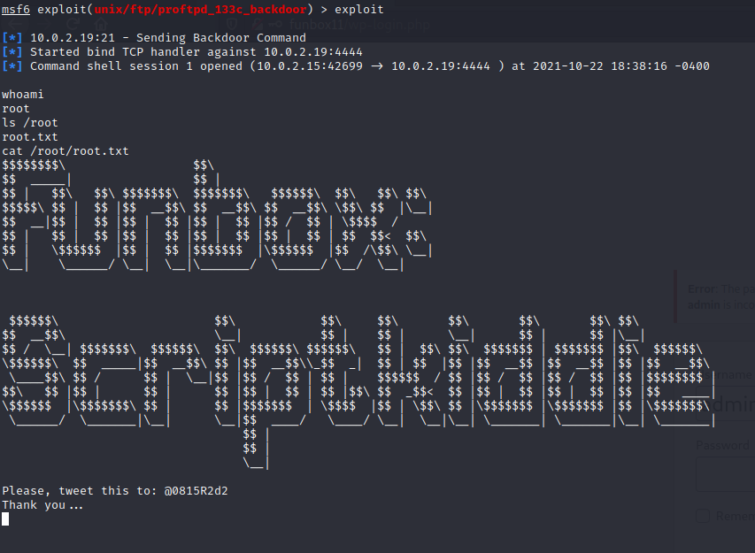](../images/scriptkiddie/msfconsole3.png)

Success!

I had a reverse shell onto the box and after running whoami I could see I was root and the flag was visible in /root/root.txt.

