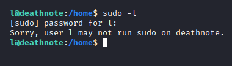

## A walkthrough of the [Deathnote](https://www.vulnhub.com/entry/deathnote-1,739/) VM from Vulnhub

This is labelled as an easy box on vulnhub.  

Initially I ran 

There was port 22 SSH and port 80 HTTP open.  I took a look at the website hosted on port 80 and added the domain name it mentioned to my /etc/hosts file deathnote.vuln.  

  
First thing I noticed was that it was a wordpress site (noticed from the url and also from the layout) and that there was a potential username mentioned from a post `Kira`. So I headed over to the wp-admin page and tried to login with the default credentials admin:password. 

  
No luck.  Then I attempted to use kira and got a incorrect password response.  After taking a look at the homepage again I saw a line of text "my fav line is iamjustic3" posted by the user `L`.

  
I tried logging into wp-admin with kira:iamjustic3 , success!

  
I had a look in the media library section and noticed a file, notes.txt.  I downloaded the file and took a look at it. 

Looks like a potential list of passwords.  So I fired up Hydra and pointed it to port 22 SSH and tried with the username kira.  No luck.  But then I remembered the user `L` and tried again.  Success.

I found user.txt in l's home directory.

  
But l is not able to run sudo.  So I did some poking around and found something interesting in /opt/L/fake-notebook-rule

  

  
From the hint I could see I needed to decode the value in case.wav using cyberchef.  I decoded the first hex value and then decoded the base64 value I got to reveal kiras password.

  
After logging into ssh with kira I checked what kira could run as sudo, all :) 

  
I then ran /bin/bash with sudo to get a root shell and then I could read the root flag.  
  

This was a fun machine which just required you to follow the clues. 
