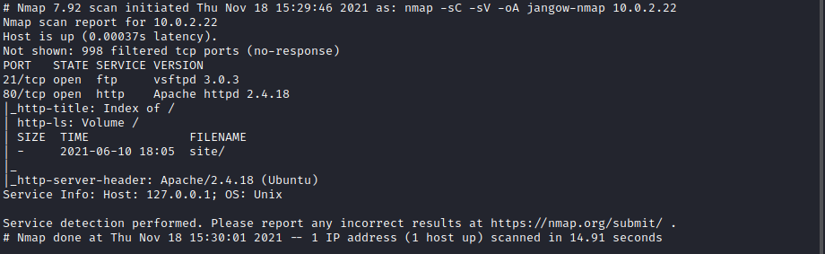

## A walkthrough of the [jangow](https://www.vulnhub.com/entry/jangow-101,754/) VM from Vulnhub

This is labelled as an easy box on vulnhub.  

Initially I ran nmap to see what ports are open

There was port 21 FTP and port 80 HTTP open.  I tried to login to the ftp with anonymous:anonymous and was unsuccesful.  So I took a look at the website. 

  
I poked around on the website and there was nothing much of interest until I came across `busque.php` which looked like it had PHP code injection after a quick test.

  
Using `ls` I took a look at what was visible and found the user flag as well as an interesting wordpress config file with credentials. 

  

  
Using the username I found in the /home directory of `jangow01` and the password in the wordpress config I was able to login via ftp.  

I looked around and couldn't find too much of interest apart from a binary file located in /script/backup 

I downloaded the file and ran strings against it.

  
It appeared to leak the version of ubuntu running on the server which looked like an old version which may be vulnerable. 

I went back to busque.php and went about getting a reverse shell on the box, which took longer than I would have liked.  But I got there in the end. 

  

  
I ran linpeas.sh and it confirmed this machine was vulnerable to a few exploits based on the kernel version. 

  

I took a look at https://www.exploit-db.com/exploits/45010, I created the exploit locally and transferred it across to the victim machine.  After compiling it with `gcc 45010.c -o harmless` and making sure it had executable privileges I ran the exploit.

With that I had a root shell and was able to view the flag in /root/proof.txt

