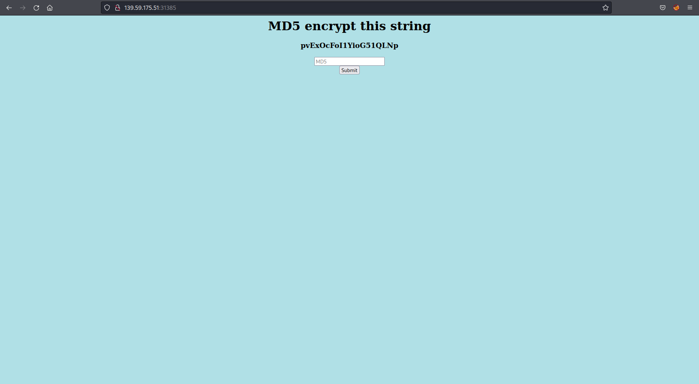
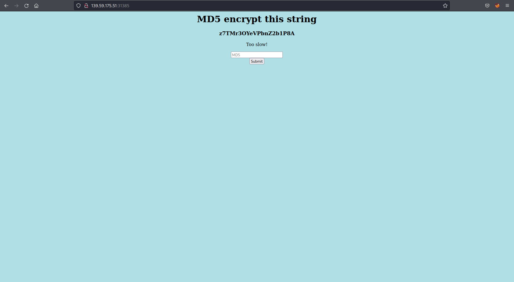

## A writeup of the HackTheBox retired easy web challenge Emdee Five For Life

After checking out the website provided I can see the title `MD5 encrypt this string` and a string below as well as a form to enter the MD5 hashed string and a submit button.  

[](../images/home.png)

I take the string and turn it into a md5 hash with the terminal:

```bash
echo '16dFzpMakCkS9x0FQ9ev' | md5sum
```

I then enter the md5 hash into the form and submit, but I am told I am too slow!

[](../images/too_slow.png)

So I realise its time to create a script to do this quickly. 

I craft a python script to do this using the requests, beautiful soup, sys and hashlib libraries:

```python
import requests
import sys
from bs4 import BeautifulSoup
import hashlib

req = requests.session()
url = sys.argv[1]
r = req.get(url)
soup = BeautifulSoup(r.text, 'html.parser')
payload = dict(hash=hashlib.md5((soup.h3.text).encode()).hexdigest())
flag = req.post(url, data=payload)
print(flag.text)
```

I run the script with the pages url and I get the flag from within the page response:

```html
<html>
<head>
<title>emdee five for life</title>
</head>
<body style="background-color:powderblue;">
<h1 align='center'>MD5 encrypt this string</h1><h3 align='center'>DKG4V1dlh5lwX3ItYvih</h3><p align='center'>HTB{N1c3_ScrIpt1nG_B0i!}</p><center><form action="" method="post">
<input type="text" name="hash" placeholder="MD5" align='center'></input>
</br>
<input type="submit" value="Submit"></input>
</form></center>
</body>
</html>
```
