## Writeup of web challenges from codegate 2022 CTF preliminary round

Over the weekend Feb 26th - Feb 27th I took part in the Codegate 2022 preliminary CTF.  I entered into the General category. 

[](../images/codegate2022/home.png)

I only managed to solve 2 of the web challenges as life got in the way.  But I really enjoyed having a go at them and here are the writeups. 

# Web Challenge - Cafe

Challenge Description:
--------------------------

```
You can enjoy this cafe :)

upload text, youtube, ...
```

[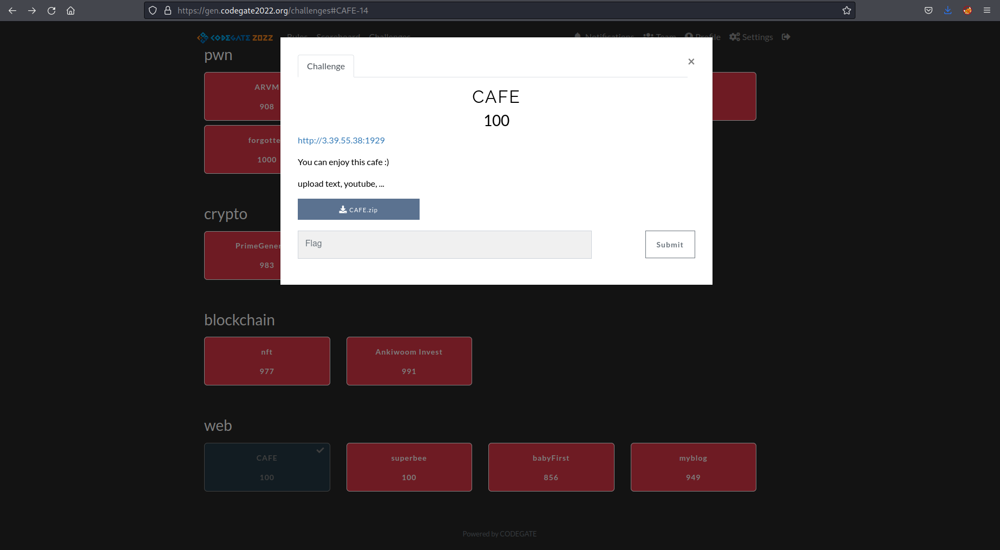](../images/codegate2022/cafe/challenge.png)

With a file to zip file to download.  

I downloaded the file and then started to look at the website.  

[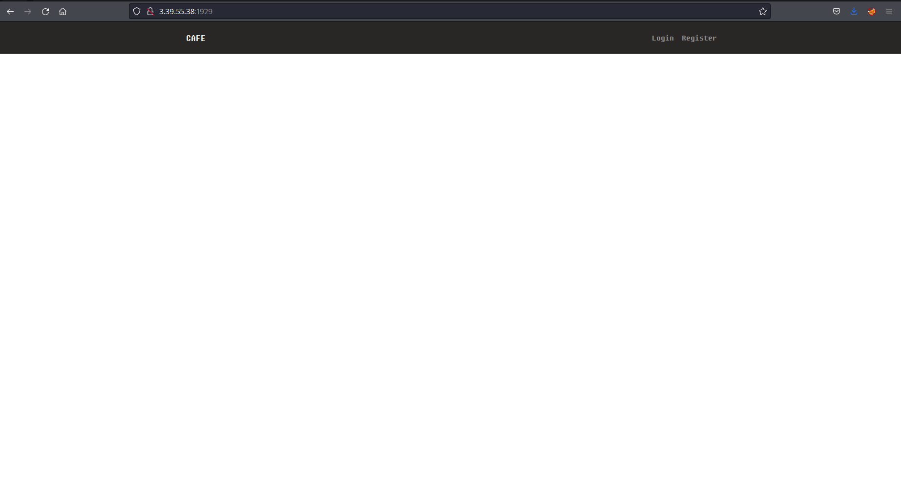](../images/codegate2022/cafe/home.png)

I registered an account and tried to acquire a cookie from an admin who may be logging in and looking at the page.  This did not work.  

[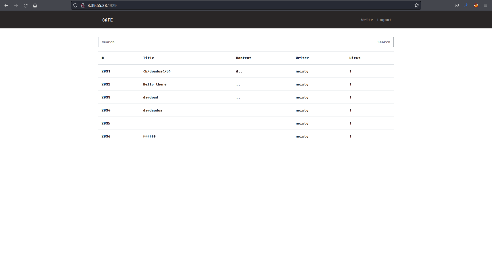](../images/codegate2022/cafe/my_user.png)

I then checked the zip file I had downloaded.  Unzipped it and had a read through some of the files.  

What caught my interest in the `bot.py` file was potential admin credentials.  

[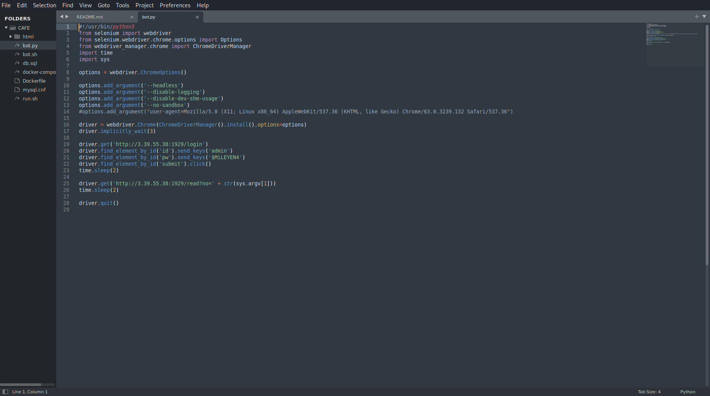](../images/codegate2022/cafe/admin_creds.png)

I tried those on the website and sure enough I was logged in.

[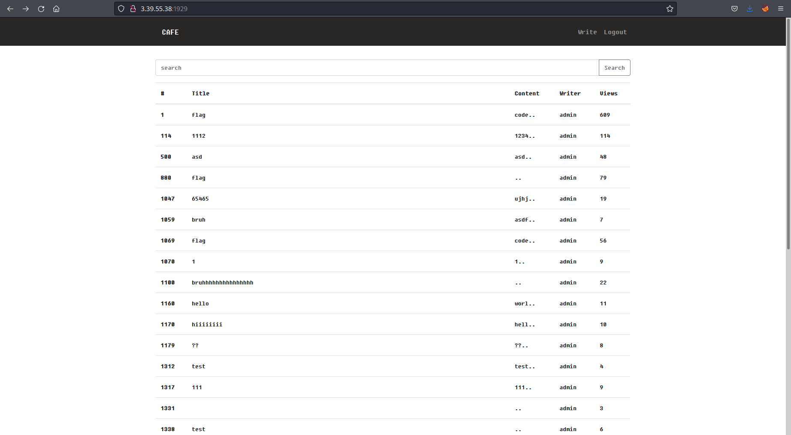](../images/codegate2022/cafe/admin_home.png)  

Looking at the file `db.sql` I could see the flag would be stored in a post entitled `flag` so I viewed the first post with this and found the flag.

[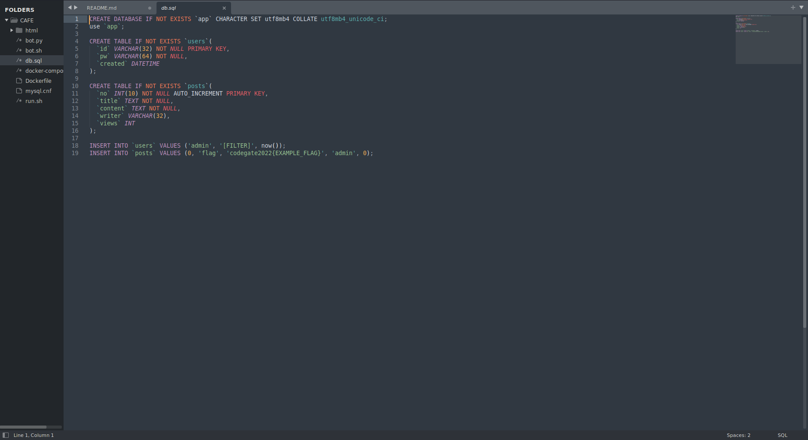](../images/codegate2022/cafe/flag_location.png)

[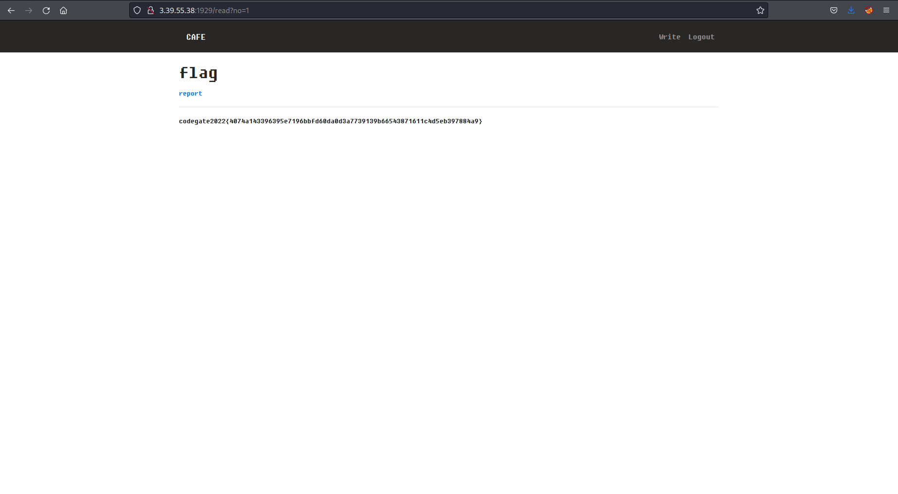](../images/codegate2022/cafe/flag.png)


# Web Challenge - Superbee

[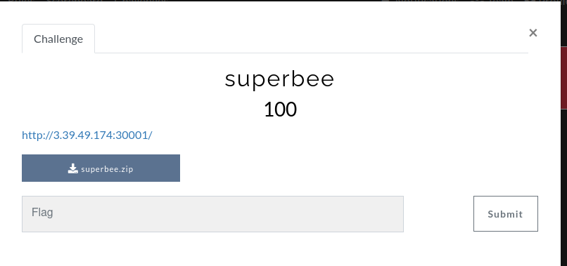](../images/codegate2022/superbee/challenge.png)

With a file to zip file to download.  

I downloaded the file and then started to look at the website.  

[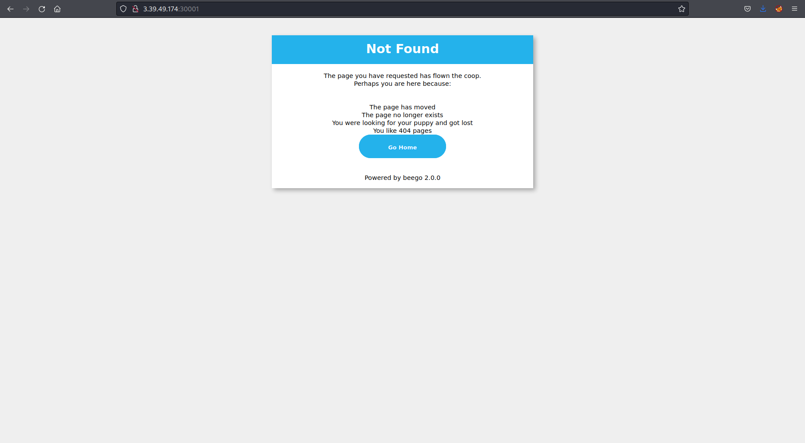](../images/codegate2022/superbee/home.png)

Initially I couldn't see anything, just the 404 page.  

I took a look at the code and noticed there was a potential url of `/login/login`.  

[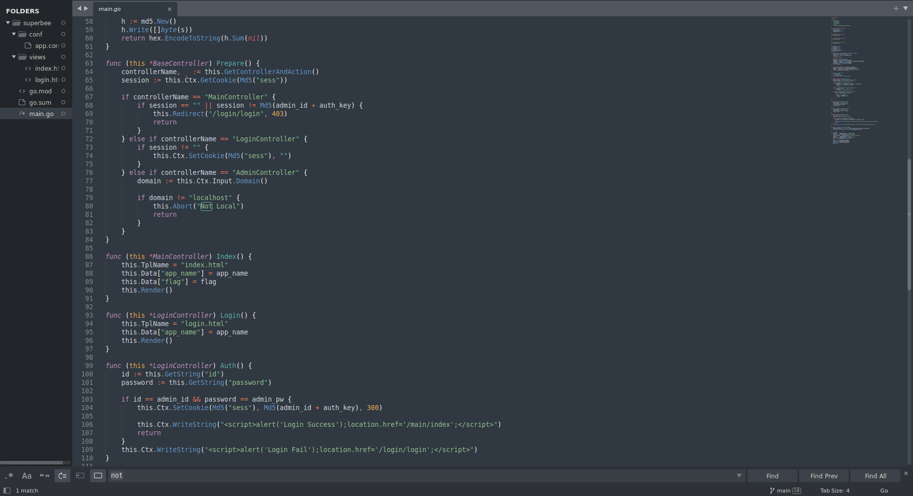](../images/codegate2022/superbee/login_login.png)

I tried the url, success. 

[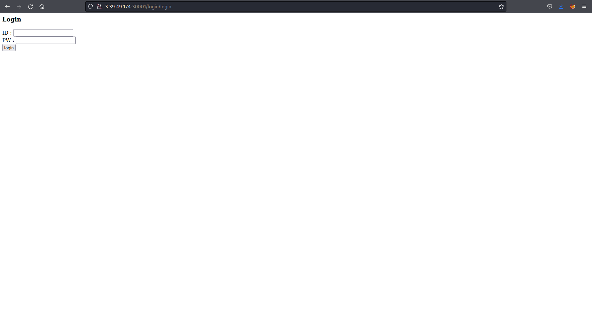](../images/codegate2022/superbee/login.png)

I tried some username and password combinations with no success.  After looking at the code again I noticed potential credentials to try:  

[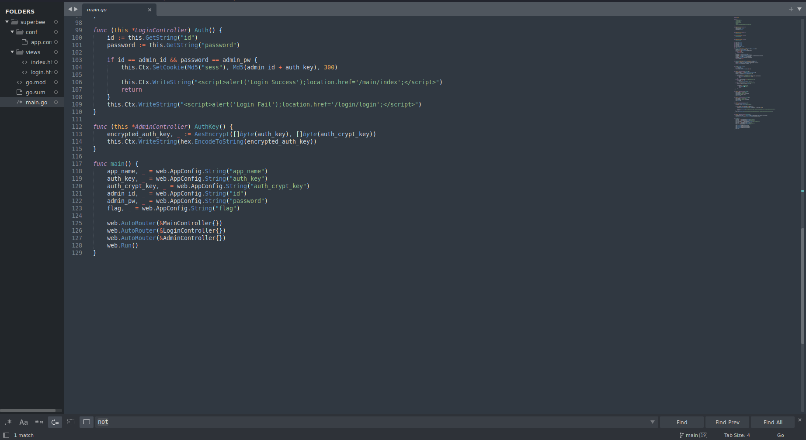](../images/codegate2022/superbee/creds.png)

I tried those on the website and sure enough I was logged in.

[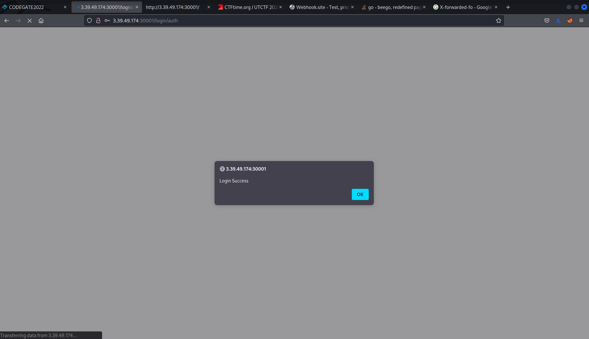](../images/codegate2022/superbee/admin_pass_success.png)

Once logged in I was greeted with the flag.

[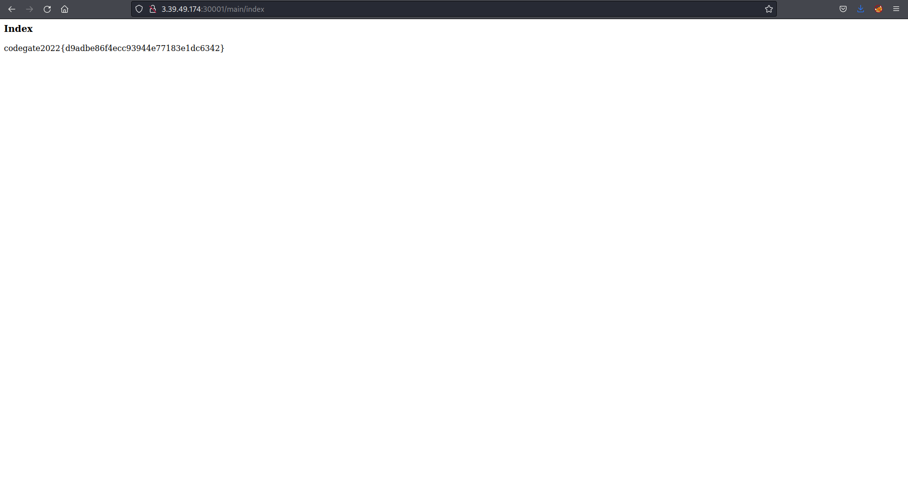](../images/codegate2022/superbee/flag.png)