## Writeup of the [DC-3](https://www.vulnhub.com/entry/dc-32,312/) Vulnhub machine

So for this easy machine I started off with the usual nmap scan

```
nmap -sC -sV 10.0.2.25 -oN nmap/dc-3
```

[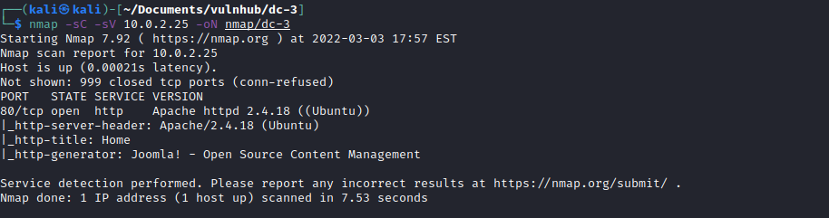](../images/dc-3/nmap.png)

I could see there was only port 80 open so I went and took a look at the website. 

[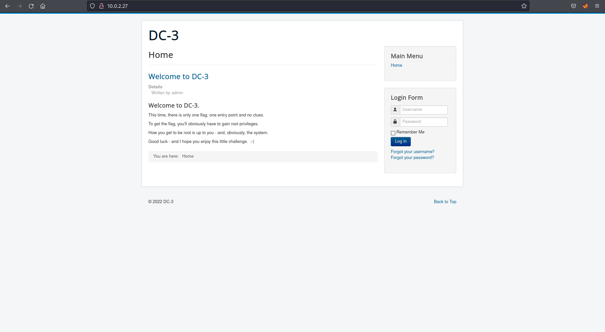](../images/dc-3/home.png)

After looking around on the site I realised it was a Joomla site and used a tool `joomscan` to determine any known vulnerabilities and version of the software. 

[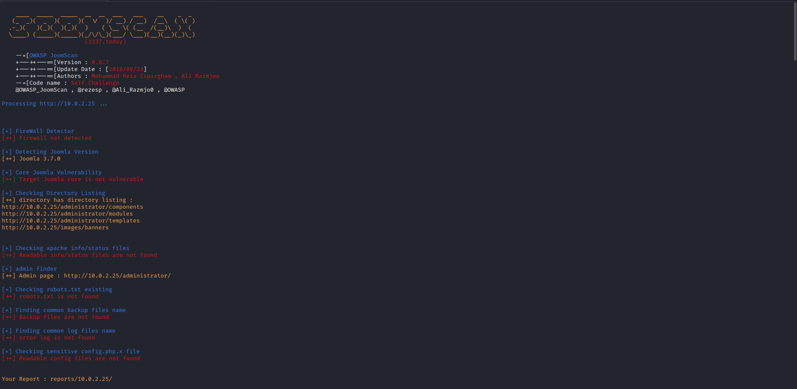](../images/dc-3/joomscan.png)

I could see the version number and had a look at known vulnerabilities on exploit-db and I found the following:

[https://www.exploit-db.com/exploits/42033](https://www.exploit-db.com/exploits/42033)

[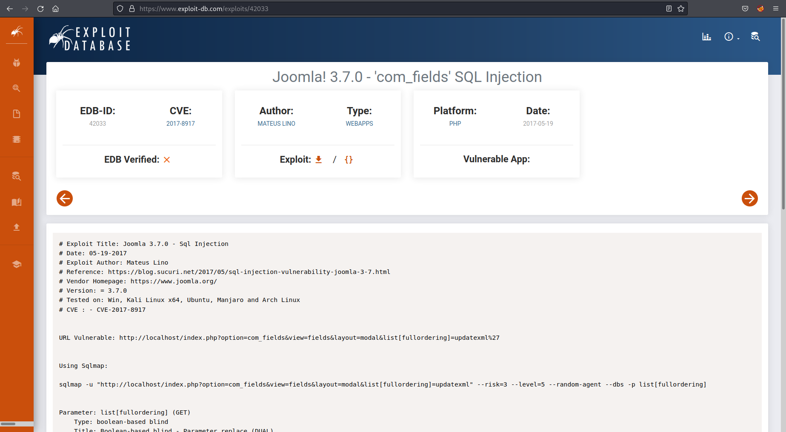](../images/dc-3/joomla_cve.png)

So after running the recommended payload 

```
index.php?option=com_fields&view=fields&layout=modal&list[fullordering]=updatexml%27` with sqlmap `sqlmap -u "http://localhost/index.php?option=com_fields&view=fields&layout=modal&list[fullordering]=updatexml" --risk=3 --level=5 --random-agent --dbs -p list[fullordering]
``` 
I was able to enumerate the databases available.  Within the joomladb db there was a users table which I was able to dump the credentials from. 

[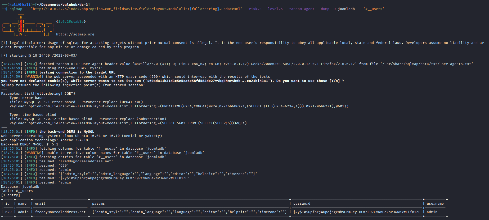](../images/dc-3/dump_creds.png)

The password was hashed as expected so I used John to crack the password. 

```
john pass.hash --wordlist=/usr/share/wordlists/rockyou.txt
```

[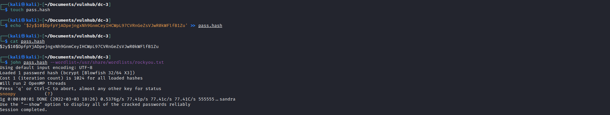](../images/dc-3/john_password.png)

With the credentials `admin:snoopy` I was able to login the administrator page for Joomla.  I knew the best way to to gain a shell was to inject my PHP reverse shell code somewhere within the website.  

I normally would look for a 404 page or plugins but in this case I just implanted the reverse shell code within the homepage. Not glamorous or quiet but was the easiest method here. 

[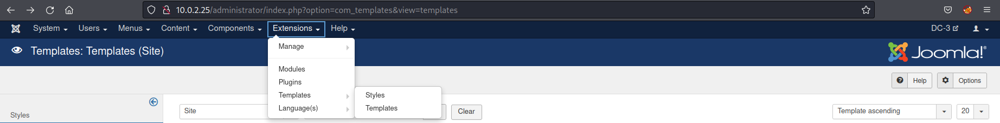](../images/dc-3/templates.png)

[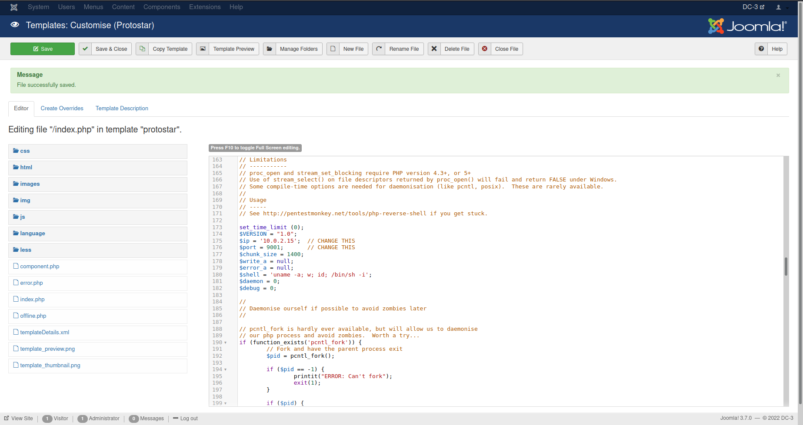](../images/dc-3/rev_php_joomla.png)

So after implanting the code I setup a netcat listener on my attack machine `nc -lvnp 9001` and browsed to the homepage.  Bingo!

[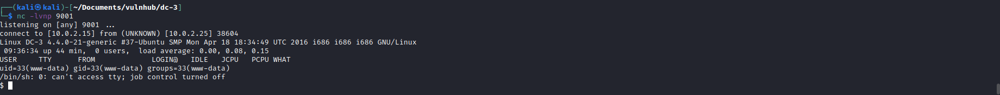](../images/dc-3/rev_shell.png)

I looked around the machine and couldn't see any easy way to gain privilege escalation.  I then noticed the version of systems OS using `uname -a`.  From this I had a look through exploit-db and found the following CVE: [https://www.exploit-db.com/exploits/39772](https://www.exploit-db.com/exploits/39772)

[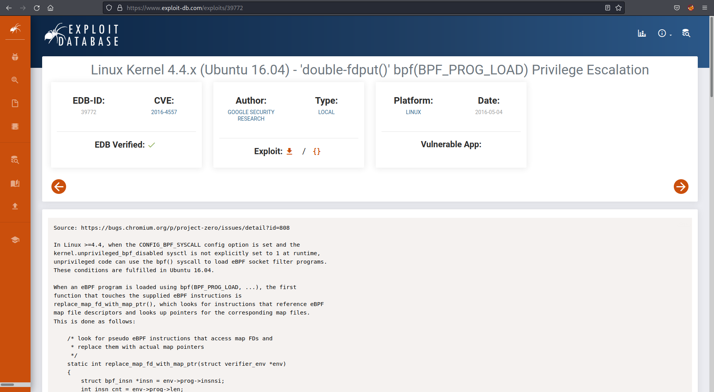](../images/dc-3/exploitdb.png)

I followed the instructions within the exploit and got shell as root with the flag. 

[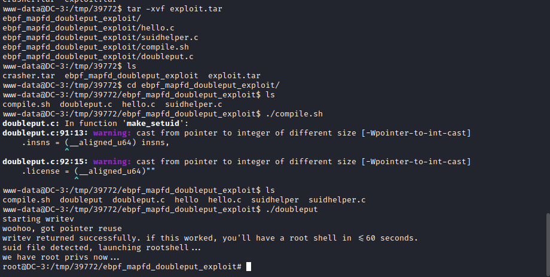](../images/dc-3/root.png)

[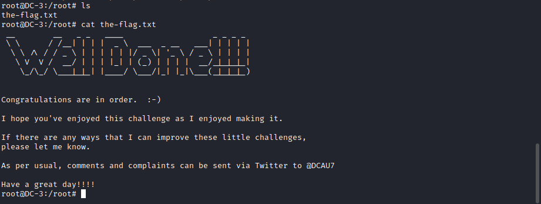](../images/dc-3/flag.png)
