## Writeup of the [Napping](https://www.vulnhub.com/entry/napping-101,752/) Vulnhub machine

So for this machine I started off with the usual nmap scan

```bash
nmap -sC -sV 10.0.2.31 -oN nmap/napping
```

[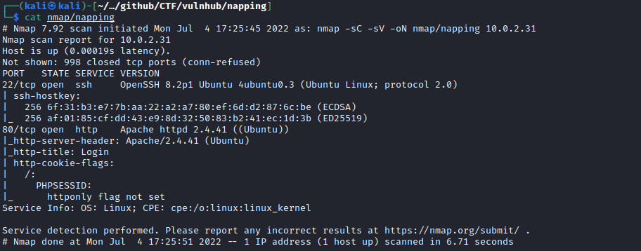](../images/napping/nmap.png)

So I can see that both SSH on port 22 and HTTP on port 80 are open.

I started by taking a look at the web server running on port 80.

[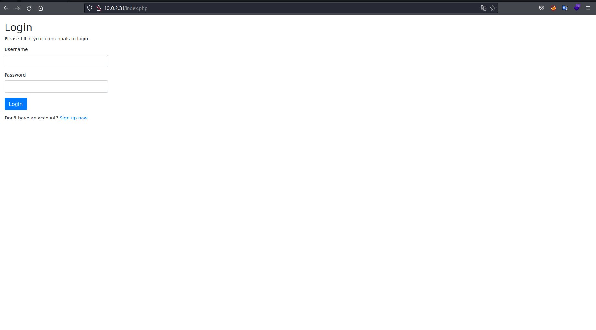](../images/napping/index.png)

There was a login screen and an option to register.  I tried some SQL injection attempts on the login page but could not get anywhere.  So I registered an account and was taken to the following page.

[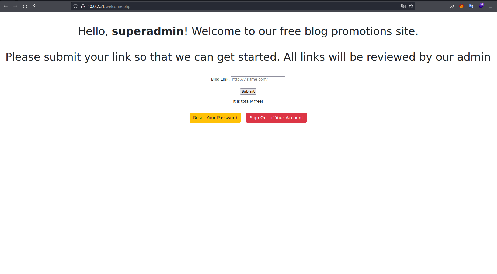](../images/napping/link_page.png)

I could see that the link I entered would be visited by an admin.  So initially I was thinking there was some way to exploit this using XSS.  I entered a link to my local IP and set up a netcat listener to make sure the request could be received.


[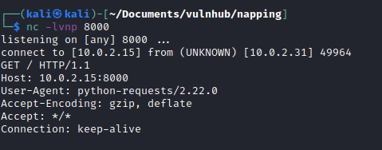](../images/napping/req.png)

I tried to get XSS to work but it was not vulnerable to it.  I got stuck here for a while and then I realised that the name of the box was hinting to the vulnerability, tab napping.  This is something I have heard of before but not something I have ever exploited or seen any POC for.  So I did some googling.  I found a couple of good articles including this one from OWASP https://owasp.org/www-community/attacks/Reverse_Tabnabbing

So I copied the code from the sites index.html into my own index.html and created a blog.html page which would house the code to perform the tab napping.

[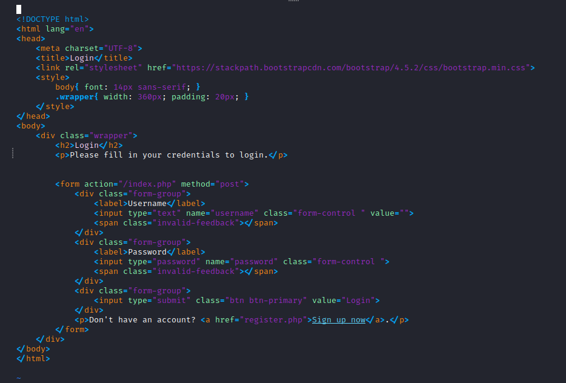](../images/napping/indexsrc.png)

[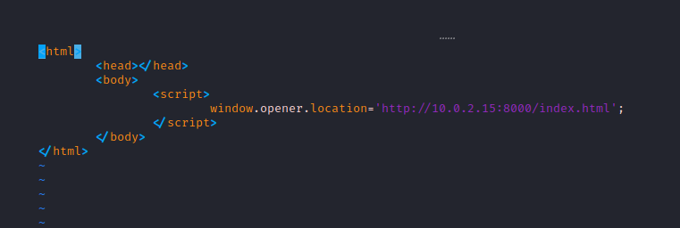](../images/napping/blogsrc.png)

With the 2 files created I started a python3 web server on port 80 and then a netcat listener on port 8000 and waited...

[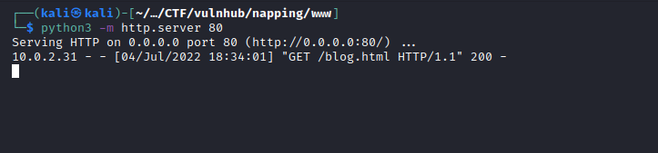](../images/napping/connection.png)

[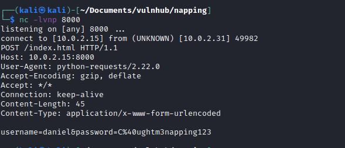](../images/napping/tabnapped.png)

Now I had the credentials for daniel `daniel:C@ughtm3napping123`.  I logged in via SSH.

[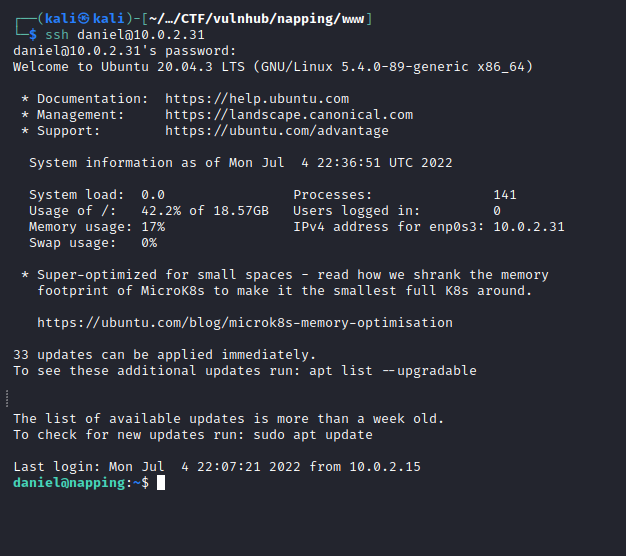](../images/napping/ssh.png)

## Priv Esc

There was no sign of a user.txt file in daniel's home directory and I noticed there was another user `adrian`.  Looking in his home directory there was a user.txt file but I could not access it as daniel.  

I could access the query.py file, which I took a look at.  

[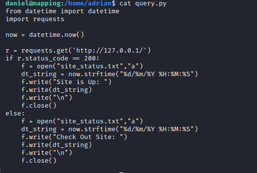](../images/napping/query.png)

As I had write permission to this file I added some code to execute a shell script which I had created in /dev/shm to get a reverse shell from the machine.

[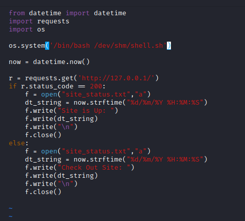](../images/napping/amendedquery.png)

[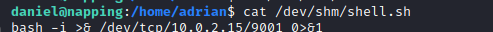](../images/napping/revshell.png)

I setup a netcat listener on my local machine and waited as I could see from the query.py file that it was due to run every few minutes.

[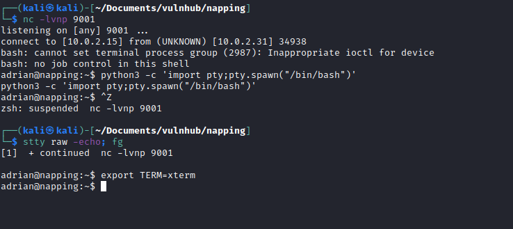](../images/napping/revshellexec.png)

I read the user.txt file in adrians home directory:

[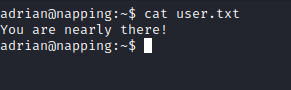](../images/napping/user.png)

## Priv Esc 2

Running `sudo -l` I could see that adrian can run `/usr/bin/vim` as sudo with no password.

[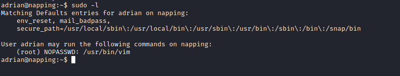](../images/napping/sudo.png)

I checked GTFOBins to see if there was a way to use this to escalate my privileges to root.  And there was a very simple way to do it:

```bash
sudo /usr/bin/vim -c ':!/bin/sh'
```

[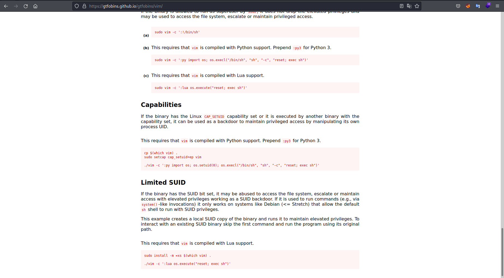](../images/napping/gtfobins.png)

[](../images/napping/privesc.png)

I was root and I read /root/root.txt.

This was a fun machine, first one I have completed in a while.  I will be posting more blog posts and writeups as I get back into the swing of things.  Thanks for reading. 
