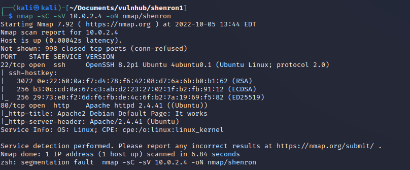

## Writeup of the [Shenron1](https://www.vulnhub.com/entry/shenron-1,630/) Vulnhub machine

I have been slacking off lately and not doing many vulnerable machines and writeups.  This is going to change and this is the first writeup of many I am hoping to post in the coming weeks.  

This is labelled as a beginner machine.  Lets go.  Starting off with a nmap scam

```bash
nmap -sC -sV 10.0.2.4 -oN nmap/shenron
```

[](../images/shenron1/nmap.png)

So I can see that both SSH on port 22 and HTTP on port 80 are open.

I started by taking a look at the web server running on port 80.

It showed a default apache installation page

[](../images/shenron1/apache.png)

So I ran a feroxbuster scan to see what other interesting pages I could find. 

[](../images/shenron1/feroxbusterScan.png)

So /test looks interesting, lets take a look at it.

[](../images/shenron1/testPage.png)

Hmmm a bit cryptic.  I wonder if there is more in the source code of the page.

[](../images/shenron1/credentials.png)

Nice.  So I also noticed from the feroxbuster scan that there appears to be a joomla installation on this machine.  So I tried the credentials at `/joomla/administrator` and was able to login.

[](../images/shenron1/imIn.png)

I have not had much experience with Joomla before, but I know from hacking some wordpress sites in the past one of the easiest ways to get a reverse shell is to inject a reverse php shell into one of the pages. 

So I targeted the index.php page and added a php reverse shell from pentestmonkey.

[](../images/shenron1/revshell.png)

I set a netcat listener on my machine `nc -lvnp 9001` and then browsed to the index page. 

[](../images/shenron1/revshellsuccess.png)

I upgraded my shell

```
python3 -c 'import pty; pty.spawn("/bin/bash")' 
ctrl+z
stty raw -echo && fg
<press enter>
export TERM=xterm
```
So I had a reverse shell as www-data and it was time to escalate my priveleges.  I figured there would be some credentials hidden inside the joomla installation somewhere and I found the configuration.php file. 

[](../images/shenron1/joomlaconfig.png)

And with that I was now able to login as jenny

```
su - jenny
```
[](../images/shenron1/jennysudo.png)

By checking sudo -l I can see that jenny can run `/usr/bin/cp` as the user shenron.  This was interesting and after searching around on google for a while, I figured that I can either copy a file out of a location that shenron can access.  Or I can copy a file into a folder shenron can access.  Then it was clear, I could generate a SSH key on my attacker machine and upload the public key into the authorized_keys of shenron.  Which would allow me to ssh into the box as shenron.

`ssh-keygen`

`python3 -m http.server 80`

On the victim machine I requested the id_rsa.pub file and then copied the contents into a file called `authorized_keys`.  

I then used the command I could run as shenron to copy this file into /home/shenron/.ssh/

[https://gtfobins.github.io/gtfobins/cp/](https://gtfobins.github.io/gtfobins/cp/)

```
sudo -u shenron /usr/bin/cp authorized_keys /home/shenron/.ssh/
```

[](../images/shenron1/cpssh.png)

After amending the permissions on the id_rsa key I had on my attacker machine `chmod 600 id_rsa` I was able to login to the box with ssh.

```
ssh -i id_rsa shenron@10.0.2.4
```
[](../images/shenron1/sshsuccess.png)

With that I was able to find my first flag in /home/shenron.  I did get a little stuck here and tried to look for further credentials or folders that shenron could only open.  This is when I came across `/var/opt/password`

[](../images/shenron1/shenpass.png)

I could then run `sudo -l` to see what commands shenron could run as sudo. 

[](../images/shenron1/shensudo.png)

Looking at gtfobins again to see what I could do with `apt` and I found the key to priv esc to root.  And found the root flag.

[https://gtfobins.github.io/gtfobins/apt/](https://gtfobins.github.io/gtfobins/apt/)

`sudo apt update -o APT::Update::Pre-Invoke::=/bin/sh`

[](../images/shenron1/root.png)

This was a really fun machine which actually was challenging at parts.  I am going to be doing the other 2 machines in the shenron series from vulnhub so please check back to see the other 2.  

Thanks for the taking the time to read this. 