## Writeup of the [Shenron2](https://www.vulnhub.com/entry/shenron-2,677/) Vulnhub machine

Shenron1 was great, now time to tackle number 2.  Should be another easy machine but you never know.  Sometimes its just something you don't know and you need to google your way out of it. 

[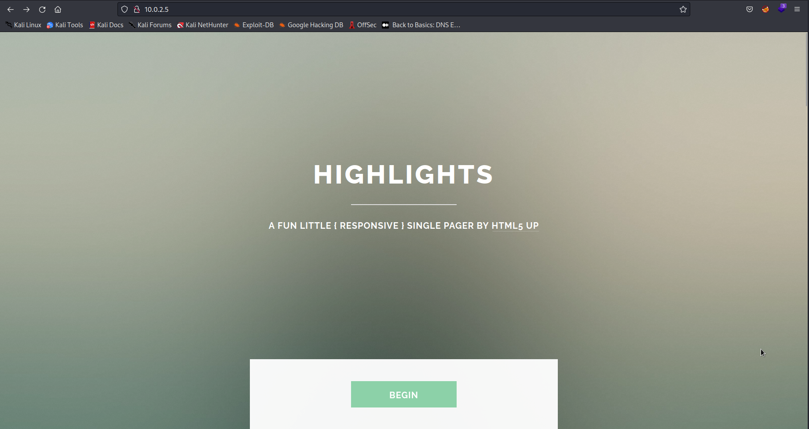](../images/shenron2/80.png)

```bash
nmap -sC -sV 10.0.2.5 -oN nmap/shenron2
```

[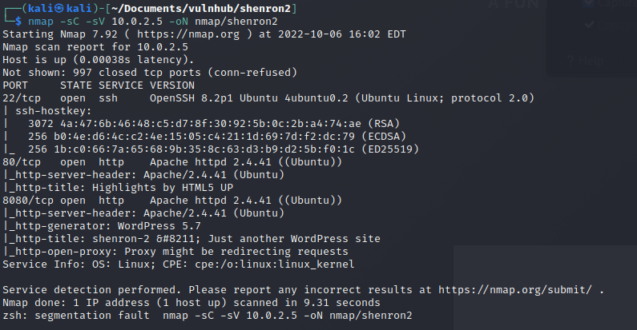](../images/shenron2/nmap.png)

So I can see that both SSH on port 22 and HTTP on port 80 are open.  But this time I also see port 8080 open and it looks like it could be running a wordpress site.  Lets start off by taking a look at the website running on port 80.

[](../images/shenron2/80.png)

I had a look around this site, checked robots.txt and the source code and couldn't find anything interesting.  I think I will leave this for now and move onto port 8080. 

Initially the site looked broken so I checked some of the links `shenron:8080/` was being referenced.  So I added it to my `/etc/hosts` file:

```
sudo vi /etc/hosts
```
[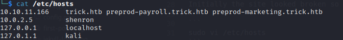](../images/shenron2/etchosts.png)

Now the site looks better time to enumerate.

[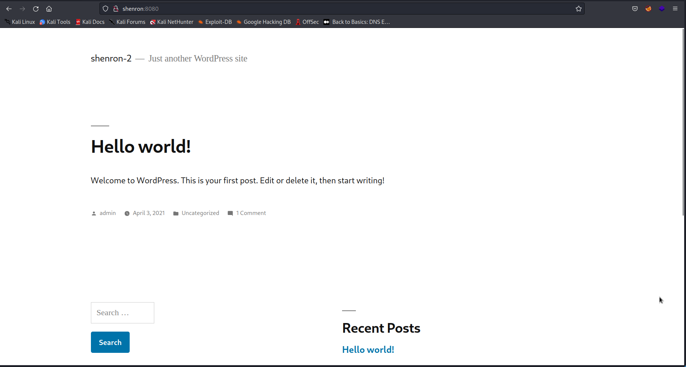](../images/shenron2/8080.png)

So I couldn't find anything of note initially until I tried the wp-admin login page.  I attempted the default creds `admin:password` which confirmed that admin was a valid user.  It wouldn't be `admin:admin` would it? Really?

[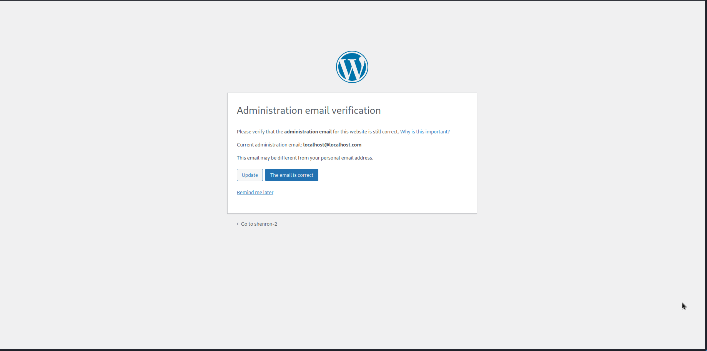](../images/shenron2/wplogin.png)

Now I was inside wordpress it should be easy to get a reverse shell.  Well this time it was not.  I tried amending the 404 page to include a php reverse shell but I didn't have write privileges.  I attempted to upload a php shell as a plugin, but I didn't have write privileges. 

[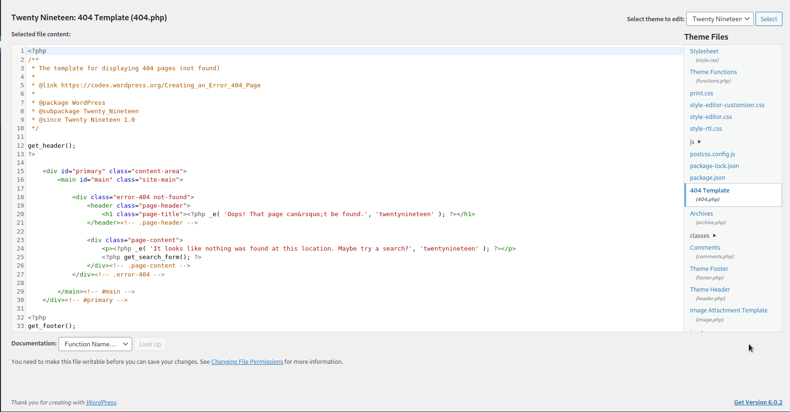](../images/shenron2/noedit.png)

I even tried using metasploit with its wp_admin_shell_upload and that didn't work.  I was stuck :(

But then I remembered one important part of Wordpress enumeration, wpscan.  Wpscan is a tool which can be used to identify vulnerable plugins or any known vulnerabilities associated with whats running on the wordpress site.  

I gave it a go and it identified a vulnerable plugin:

[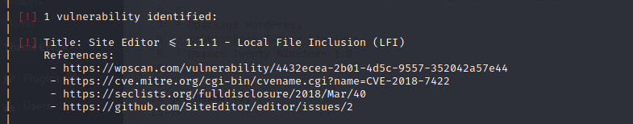](../images/shenron2/cve.png)

[https://seclists.org/fulldisclosure/2018/Mar/40](https://seclists.org/fulldisclosure/2018/Mar/40)

I read the POC and gave it a go.  Sure enough I could read the `/etc/passwd` file on the server.  And I see Jenny and Shenron as users again.  

[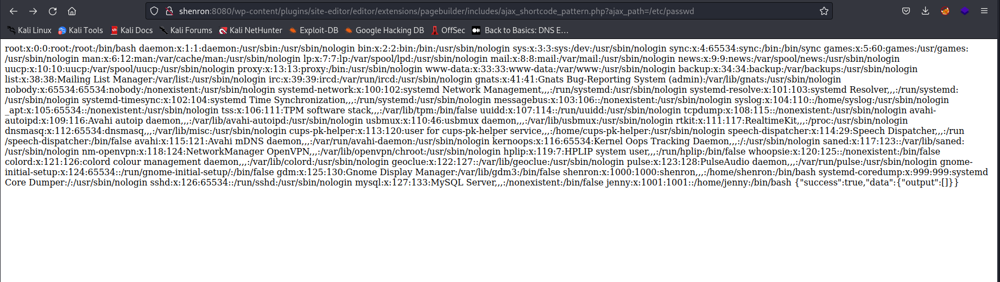](../images/shenron2/lfi.png)

But now I was stuck again. There was no way to get a reverse shell and I couldn't read the wp-config.php file on the server.  What to do...

Well I guess its time to brute force the jenny ssh login. If in doubt, kick the door down. 

[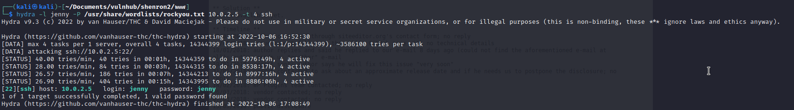](../images/shenron2/hydra.png)

Nice secure password :D 

Once logged in as jenny I tried `sudo -l` and jenny could not run sudo.  I got a little bit stuck and ran linpeas [https://github.com/carlospolop/PEASS-ng/tree/master/linPEAS](https://github.com/carlospolop/PEASS-ng/tree/master/linPEAS)

I didn't notice anything there and then checked for any SUID files I could use to priv esc:

[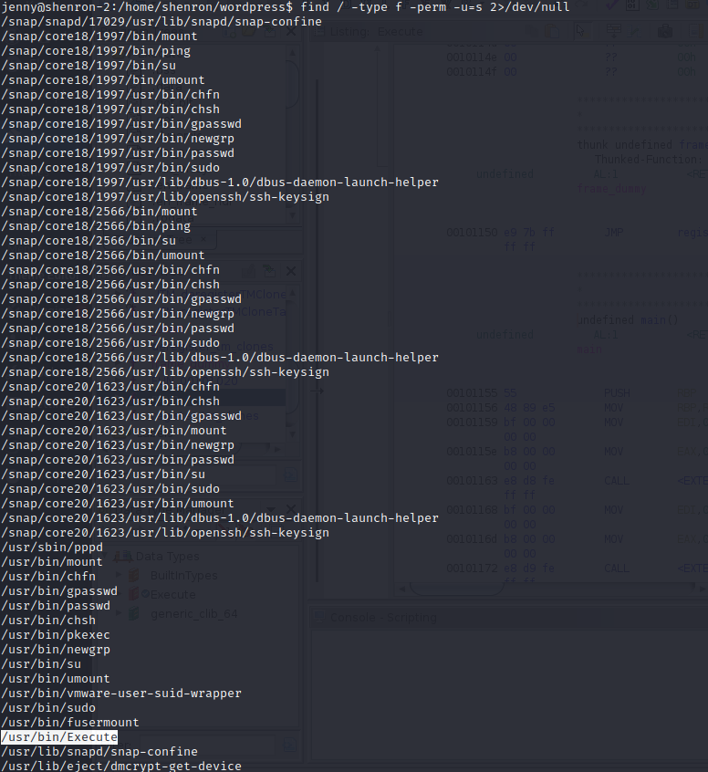](../images/shenron2/suid.png)

`/usr/bin/Execute` looks interesting.  I tried running it and nothing happened. I tried running it with the `-p` flag to try and maintain privileges but once again nothing happened. 

After some googling and some thinking I was stuck.  The only thing I had was this executable.  So why not take a look at it with ghidra.  I am in no way good at reversing binaries but in this case I struck it lucky when I had a look at the main function:

[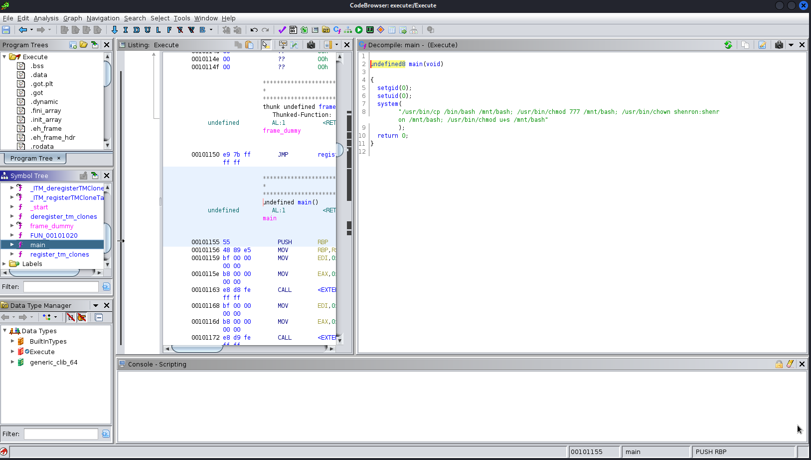](../images/shenron2/ghidra.png)

So it was copying /bin/bash to /mnt/bash and then making shenron the owner and setting it as a SUID binary.  So now I ran `/usr/bin/Execute` again just to make sure and then then ran:

```
/mnt/bash -p
```

And a quick check of `id` showed I was now able to run commands as shenron.

[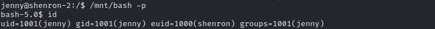](../images/shenron2/mntbash.png)

I found the user flag in `/home/shenron/Desktop`

[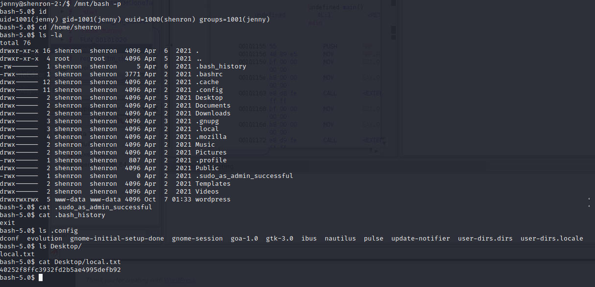](../images/shenron2/usertxt.png)

At this point I missed the other file in this folder and went off down a rabbit hole looking for further credentials/vulnerabilities.  I ran linpeas again and found nothing.  I then traced my steps back and found the .pass file in the Desktop folder. 

[](../images/shenron2/shenencryptpass.png)

A quick run through [cyberchef](https://gchq.github.io/CyberChef/) and I could see it was in base32 and I appeared to have shenrons password (minus the . after a few frustrating attempts to login).

[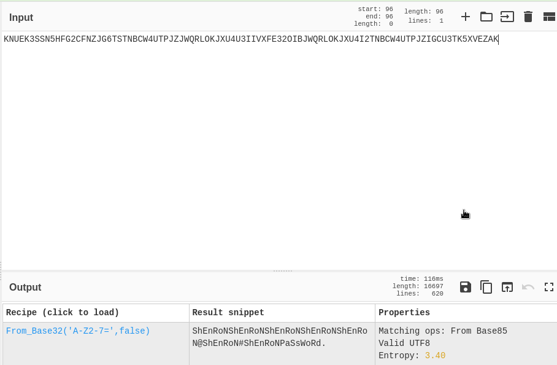](../images/shenron2/shenpass.png)

Now a quick check of `sudo -l` showed I could run any command as root.  So it was time for the good old:

```
sudo /bin/sh
```

[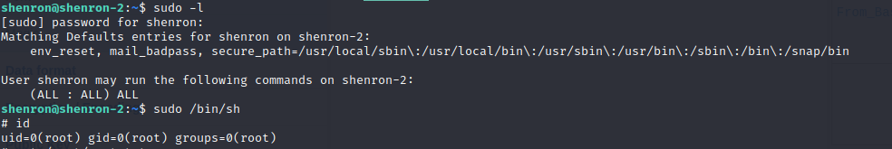](../images/shenron2/rootprivesc.png)

I am root! :D

[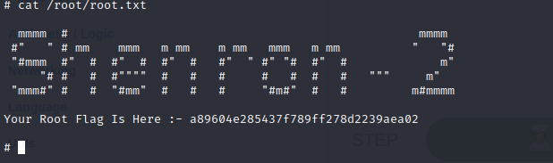](../images/shenron2/root.png)

Another fun machine to pwn but I found this a little difficult.  I did not expect an element of reversing in a beginner machine and that had me stuck for longer than I would have liked.  But great machine for learning and I have learnt a few things I need to work on:

1. Make sure I trace my steps back if I am stuck to see if I have missed something. 
2. If I have something and nothing else, focus on that something until I am sure it is not useful (the binary)

Thanks again for taking the time to read this.  Next time, shenron 3. 

Meisty