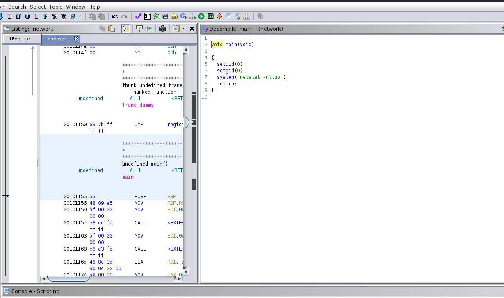

## Writeup of the [Shenron3](https://www.vulnhub.com/entry/shenron-3,682/) Vulnhub machine

Shenron1... done.  Shenron2...done.  Now for the finale.  I have enjoyed the first 2 machines, lets see what challenges lie in store for the last machine. 

[](../images/shenron3/wpfixed.png)

```bash
nmap -sC -sV 10.0.2.6 -oN nmap/shenron3
```

[](../images/shenron3/nmap.png)

So looks like we only have port 80 open and from the banner it looks like another wordpress site.  Checking it out, looks like I need to add `shenron` to my `/etc/hosts` file.

[](../images/shenron3/wpbroken.png)

[](../images/shenron3/wpfixed.png)

I had a look around the wordpress site and found nothing interesting.  I tried to login on the `/wp-admin` page with `admin:admin` and `admin:password` but had no success.  Although the login page told me the admin username existed.  

So time to bruteforce.  

I used wpscan with the infamous password wordlist `rockyou.txt`

```bash
wpscan --url http://shenron -U admin -P /usr/share/wordlists/rockyou.txt
```

It took a little while, but we had success. 

[](../images/shenron3/wppass.png)

After logging in as admin I thought I would try and get a reverse shell by adding a PHP reverse shell to one of the theme pages. I picked the 404.php page

[](../images/shenron3/revshell.png)

That did not work as I couldn't figure out where the 404 page was.  So I tried using metasploit.  

[](../images/shenron3/wp_admin_shell.png)

Now I have a shell on the box as www-data.

I found the `wp-config.php` file in the wordpress installation and tried the password to login as shenron, no luck. 

[](../images/shenron3/wp-config.png)

I ran linpeas to see if there was any obvious way to escalate privileges, again no luck.  I was stuck.  I sat here for longer than I would care to admit, until I remembered something I need to work on.  Password re-use.  Which to be honest, is a good thing to remember when working on vulnerable machines and real life examples.  As people love to re-use passwords.  So I tried `iloverockyou` with the user shenron and I now had a shell as shenron. 

I found the user flag and noticed an executable in shenrons home directory `network`. 

[](../images/shenron3/usertxt.png)

[](../images/shenron3/network.png)

It looks like executing network with `./network` is running some inbuilt command.  I copied the executable to `/dev/shm` and then downloaded it to my kali machine to analyze it. 

```bash
cp network /dev/shm
python3 -m http.server 8000


wget http://10.0.2.6:8000/network
```
I then opened it up with ghidra to take a closer look at it. 

[](../images/shenron3/ghidra.png)

Looks like it is running `netstat`.

Well we can exploit this, by [Hijacking Relative Paths in SUID Programs](https://medium.com/r3d-buck3t/hijacking-relative-paths-in-suid-programs-fed804694e6e)

```bash
cd /dev/shm
echo 'bash -i #' > netstat
chmod +x netstat
export PATH=/dev/shm/:$PATH
cd /home/shenron
./network
```

[](../images/shenron3/privesc.png)

[](../images/shenron3/root.png)

And there we have it.  All 3 shenron machines pwned.  This one was pretty straight forward apart from the password re-use step.  Which is something I obviously need to work on :)  Thanks for taking the time to read this and I will be posting some more walkthroughs/writeups in the near future. 