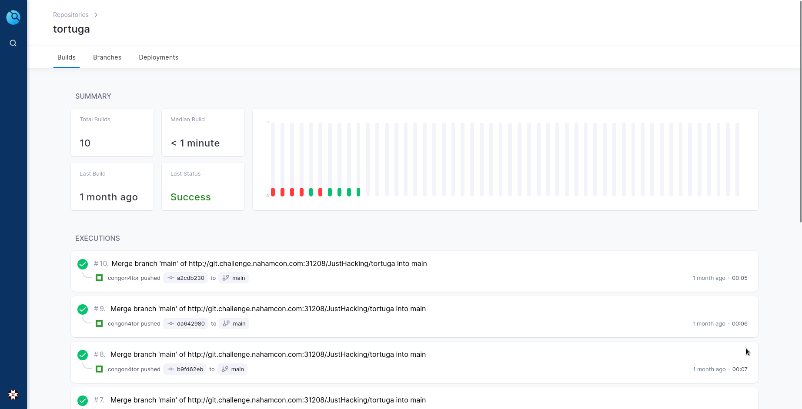
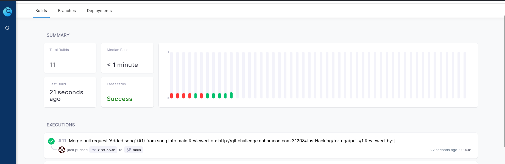

## Writeup of the medium devops challenge Pirates from Nahamcon 2023 CTF

Nahamcon 2023 CTF was a capture the flag event that ran from the 15th - 17th June 2023.  It was an event with 60 challenges spanning across many categories.  

I mostly looked at the web challenges but I gave this devops challenge a go and I really enjoyed it. 

We were the 5th team to solve this one, which was a good feeling. 


[](../images/nahamcon2023/pirateschall.png)

The challenge description provided us with some git credentials and 2 urls.  One for the gittea repositories and the other for the drone CI pipeline platform. 

I logged into the gittea account for Jack and took a look at the code respoitory.  Seems like a way to change text into pirate language, interesting. 

[](../images/nahamcon2023/piraterepo.png)

Looking at the files the .drone.yml and the piratize.sh files seemed interesting to me. 

My thought was I could inject some code into one of these files to extract the flag from the underlying environment some how. I logged into the drone CI account and checked the pipelines that had previously been ran. 

[](../images/nahamcon2023/ci.png)

Seems like whenever a branch is merged the pipeline is ran. 

So lets try and prepare a code change on my own branch and create a pull request. I amended the piratize.sh file to inject a command to try and find the flag and then cat it to the console when the pipeline was ran.   After some googling and some trial and error in my own local terminal I came up with this:

```bash
find / -name flag* -exec cat {} +
```
[](../images/nahamcon2023/payloadpirate.png)

This would find any files matching the pattern flag+anything and then cat the contents to the console. After preparing a branch and creating a pull request I came up against the first hurdle. 

[](../images/nahamcon2023/cantapprove.png)

Obviously I would need someone to approve my pull request before it could be merged.  Damn.  But when looking in the open pull requests I spotted one from the author turner.  I could add some code to his PR and because it had been opened by him I would be able to approve the pull request and then merge it.

[](../images/nahamcon2023/turnersprpirate.png)

I added my commit to tuners branch, approved the pull request and then merged it.

[](../images/nahamcon2023/approvepr.png)

[](../images/nahamcon2023/merged.png)

After a few seconds I refreshed the page on the drone CI page and I saw my pipeline had been generated.

[](../images/nahamcon2023/cipipeline.png)

Lets check in the output to see if we have the flag. 

[](../images/nahamcon2023/flag.png)

Thanks for taking the time to read this, I will be adding a few more writeups from the Nahamcon 2023 CTF over the coming days.
